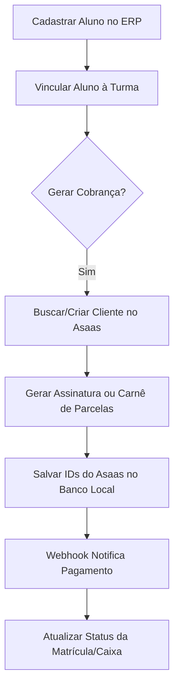

# Integração Asaas - Visão Geral do Sistema

O Asaas é a plataforma homologada para o processamento de pagamentos, geração de boletos, links de Pix e cobranças por cartão de crédito no ecossistema do **Universo Cursos e Consultoria**. 

Este documento descreve a arquitetura geral da integração, ambientes e fluxo de dados.

---

## 1. Ambientes e Credenciais

A API do Asaas opera em dois ambientes distintos. Cada polo/empresa no sistema pode configurar suas próprias credenciais no painel de configurações para separar o faturamento.

| Parâmetro | Sandbox (Desenvolvimento/Testes) | Produção (Real) |
| :--- | :--- | :--- |
| **Endpoint Base** | `https://api-sandbox.asaas.com/v3` | `https://api.asaas.com/v3` |
| **Painel Web** | `https://sandbox.asaas.com` | `https://www.asaas.com` |
| **Tipo de Chave** | `access_token` iniciando com `$` | `access_token` de produção |

> [!IMPORTANT]
> O cabeçalho de autenticação deve ser enviado em cada requisição HTTP como:
> `access_token: YOUR_API_KEY`

---

## 2. Fluxo Geral de Cobrança Acadêmica

O ciclo de faturamento dos alunos segue as seguintes etapas hierárquicas:

1. **Parceiro (Aluno)**: O cadastro do aluno no ERP deve conter campos válidos como **Nome Completo**, **CPF/CNPJ**, **E-mail**, **Celular** e **Endereço**.
2. **Matrícula**: Ao matricular o aluno em uma turma, o ERP verifica se o aluno já possui um `asaas_customer_id` registrado. Se não possuir, realiza a chamada ao Asaas para criá-lo.
3. **Plano Financeiro**: Com base nas regras financeiras da turma (Valor da matrícula, quantidade de parcelas e valor da mensalidade), o sistema emite:
   - Uma cobrança única para a Matrícula.
   - Uma assinatura recorrente ou um parcelamento (Carnê) para as mensalidades.
4. **Split de Pagamentos**: Para cursos em convênio com parceiros, as cobranças contêm regras de split de pagamento para direcionar uma porcentagem/valor fixo diretamente à carteira do parceiro no Asaas.

---

## 3. Estrutura de Tabelas de Suporte no Banco de Dados

Para viabilizar a conciliação e rastreamento, o banco de dados do ERP (Supabase) mapeará os seguintes campos (a serem implementados nas tabelas correspondentes):

*   `parceiros.asaas_customer_id` (TEXT): Armazena o identificador do cliente no Asaas (`cus_...`).
*   `matriculas.asaas_subscription_id` (TEXT): Armazena o ID da assinatura recorrente associada à matrícula do aluno (`sub_...`).
*   `caixa_movimentacoes.asaas_payment_id` (TEXT): Armazena o ID da cobrança avulsa ou parcela paga no Asaas (`pay_...`).
*   `asaas_config`: Tabela operacional já existente para armazenar o `apiKey` e `walletId` de cada polo configurado.
