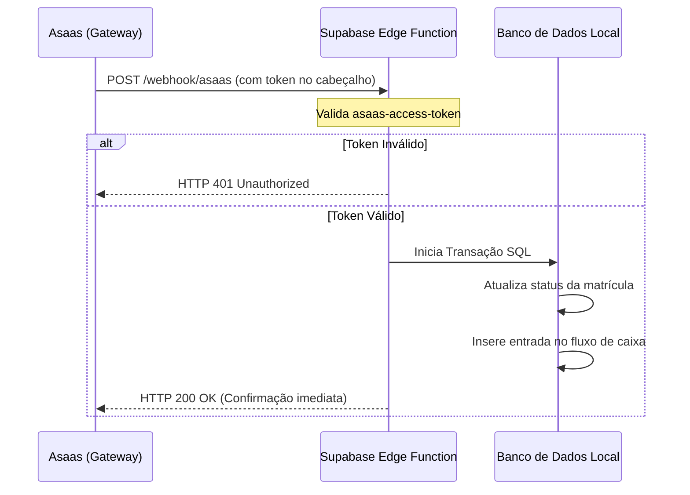

# Integração Asaas - Webhooks (Retorno Automatizado)

O Asaas utiliza Webhooks para manter o ERP atualizado sobre o status dos pagamentos. Sempre que um boleto é pago, vencido ou cancelado, o Asaas realiza uma chamada HTTP `POST` para a URL configurada no ERP.

---

## 1. Eventos Críticos de Pagamento

Os principais eventos que o ERP deve escutar e processar são:

| Evento | Significado | Ação no ERP |
| :--- | :--- | :--- |
| `PAYMENT_CREATED` | Nova cobrança gerada no Asaas | Salvar a cobrança como "Pendente" no financeiro local |
| `PAYMENT_RECEIVED` | Pagamento compensado (Boleto/Pix/Cartão) | Registrar entrada no Caixa e marcar mensalidade como "Paga" |
| `PAYMENT_OVERDUE` | Cobrança passou do vencimento | Alertar o módulo de gestão/inadimplência |
| `PAYMENT_DELETED` | Cobrança removida no Asaas | Cancelar a mensalidade no financeiro local |
| `PAYMENT_REFUNDED` | Pagamento estornado | Registrar saída de caixa/estorno |

---

## 2. Estrutura do Payload Recebido (JSON)

Exemplo de dados enviados pelo Asaas em uma compensação de pagamento:

```json
{
  "event": "PAYMENT_RECEIVED",
  "dateCreated": "2026-06-18T19:50:00Z",
  "payment": {
    "id": "pay_983748293748",
    "customer": "cus_000005748392",
    "subscription": "sub_00000998877",
    "value": 350.00,
    "netValue": 348.01,
    "billingType": "PIX",
    "status": "RECEIVED",
    "dueDate": "2026-07-10",
    "paymentDate": "2026-06-18",
    "clientPaymentDate": "2026-06-18",
    "externalReference": "turma-matricula-id"
  }
}
```

---

## 3. Fluxo de Tratamento e Segurança (Edge Function)

A rota do Webhook deve ser protegida para evitar falsificações de pagamento. A arquitetura ideal de tratamento no ERP utiliza as **Edge Functions** do Supabase:



### Boas Práticas de Implementação:
1. **Validação do Token**: Na configuração do Webhook no painel do Asaas, defina uma chave de segurança privada (`authToken`). O Asaas a enviará no cabeçalho `asaas-access-token` de cada requisição. Sua Edge Function deve validar se este valor confere antes de processar qualquer alteração de saldo.
2. **Resposta Rápida (HTTP 200)**: O Asaas espera receber uma resposta HTTP `200` em até 3 segundos. Se a requisição expirar ou falhar, o Asaas tentará reenviar a notificação repetidamente. Responda imediatamente após receber e coloque o processamento pesado em background.
3. **Idempotência**: Sempre verifique se o ID da cobrança (`payment.id`) já foi marcado como pago no seu banco local antes de registrar um novo lançamento, prevenindo duplicidade caso o webhook seja reenviado.
